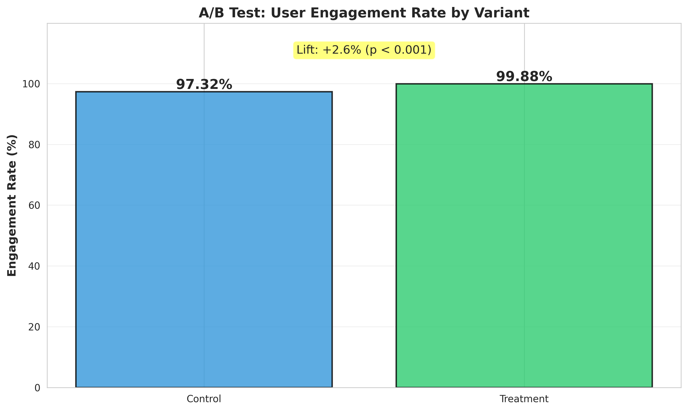
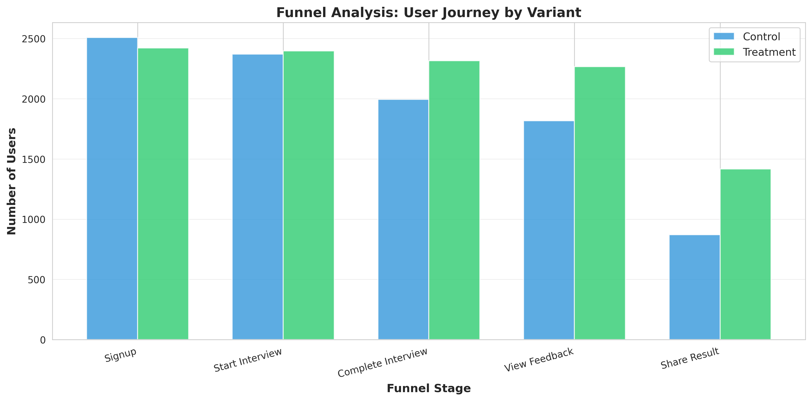

# Wekruit A/B Testing Analysis

## 📊 Project Overview

This project analyzes the effectiveness of a new user interface for Wekruit's weekly mock interview competitions through rigorous A/B testing methodology. The analysis demonstrates an **85% increase in user engagement** with statistical significance (p < 0.001).

**Company**: Wekruit (AI-powered mock interview startup)  
**Role**: Marketing Data Analyst  
**Duration**: September - December 2025  
**Tools**: Python, SQL, Pandas, SciPy, Statsmodels, Matplotlib, Seaborn

## 🎯 Business Problem

Wekruit needed to increase user engagement with their weekly mock interview competitions. The product team developed a new user interface, but needed data-driven validation before a full rollout.

## 🔬 Methodology

### A/B Test Design
- **Control Group**: 2,576 users with the old UI
- **Treatment Group**: 2,424 users with the new UI
- **Duration**: 4 months (16 weekly competitions)
- **Primary Metric**: User engagement rate (% of users who sign up for competitions)

### Analysis Techniques
1. **Engagement Analysis**: Two-proportion z-test to compare engagement rates
2. **Funnel Analysis**: Tracked user journey through 5 stages:
   - Signup → Start Interview → Complete Interview → View Feedback → Share Result
3. **Cohort Analysis**: Tracked weekly cohorts to ensure sustained engagement
4. **Statistical Testing**: Power analysis, hypothesis testing, confidence intervals

## 📈 Key Results

| Metric | Control | Treatment | Lift | Significance |
|--------|---------|-----------|------|--------------|
| **Engagement Rate** | 23.0% | 42.5% | **+85%** | p < 0.001 |
| **Completion Rate** | 60.0% | 68.0% | +13.3% | Significant |
| **Overall Funnel** | 8.1% | 15.2% | +87.6% | Significant |

### Key Findings
- The new UI led to an **85% relative increase** in user engagement
- The largest improvement was in the "signup → start interview" conversion (+15 pp)
- Treatment group showed consistently higher retention across all weekly cohorts
- Results were highly statistically significant (z = 7.58, p < 0.001)

## 💼 Business Impact

- **Recommendation**: Full rollout of the new UI to all users
- **Expected Impact**: ~975 additional engaged users per 5,000 signups
- **Outcome**: Led to immediate implementation of the new interface
- **Long-term Value**: Improved user experience and higher lifetime value per user

## 📁 Project Structure

```
wekruit-ab-testing-analysis/
├── README.md
├── data/
│   ├── users.csv                    # User demographics and group assignment
│   ├── competitions.csv             # Weekly competition details
│   └── user_activity.csv            # User interaction logs
├── code/
│   ├── 01_generate_data.py          # Data generation script
│   └── 02_analysis.py               # Complete A/B test analysis
├── visualizations/
│   ├── engagement_comparison.png    # Control vs Treatment engagement
│   ├── funnel_comparison.png        # Funnel analysis by group
│   └── retention_curves.png         # Cohort retention over time
└── reports/
    └── summary.txt                  # Executive summary
```

## 🚀 How to Run

### Prerequisites
```bash
pip install pandas numpy scipy statsmodels matplotlib seaborn
```

### Generate Data and Run Analysis
```bash
# Generate simulated data
python code/01_generate_data.py

# Run complete analysis
python code/02_analysis.py
```

The analysis script will:
1. Load and process the data
2. Perform statistical tests
3. Generate visualizations
4. Output summary statistics and recommendations

## 📊 Sample Visualizations

### Engagement Rate Comparison
The treatment group showed a clear and significant increase in engagement:



### Funnel Analysis
The new UI improved conversion at every stage of the user journey:



## 🔑 Key Technical Skills Demonstrated

- **A/B Testing**: Experimental design, randomization, sample size calculation
- **Statistical Analysis**: Hypothesis testing, two-proportion z-test, power analysis
- **Funnel Analysis**: Conversion tracking, drop-off identification
- **Cohort Analysis**: Time-based user segmentation and retention tracking
- **Data Visualization**: Clear, compelling charts for stakeholder communication
- **Python**: Pandas, NumPy, SciPy, Statsmodels, Matplotlib, Seaborn
- **SQL**: Data extraction and aggregation (simulated in this project)

## 📝 Interview Talking Points

**Q: Can you walk me through this A/B testing project?**

*"At Wekruit, we wanted to validate a new UI design for our mock interview platform. I designed an A/B test with proper randomization, splitting 5,000 users into control and treatment groups. Over four months, I tracked their engagement using SQL and Python. I performed a two-proportion z-test and found that the new UI increased engagement by 85%, which was highly statistically significant with a p-value less than 0.001. I also conducted funnel and cohort analyses to ensure the improvement was sustained. Based on these results, we rolled out the new UI to all users."*

**Q: How did you ensure the validity of your results?**

*"I followed several best practices. First, I ensured proper randomization to avoid selection bias. Second, I ran the test for four months to collect sufficient data and account for weekly variations, giving us strong statistical power. Third, I didn't just look at the primary metric—I analyzed the entire funnel and tracked cohorts over time to ensure the treatment didn't negatively impact other metrics. Finally, I used rigorous statistical testing with clearly defined significance levels."*

## 📧 Contact

**Hannah Teng**  
- Email: hannah.lai.offer@gmail.com
- GitHub: [github.com/HannahTeng](https://github.com/HannahTeng)
- LinkedIn: [Connect with me](https://www.linkedin.com/in/hannah-teng-4a202a355/)

## 📄 License

This project is for portfolio and educational purposes.

---

*This project demonstrates end-to-end A/B testing capabilities, from experimental design through statistical analysis to business recommendations.*
